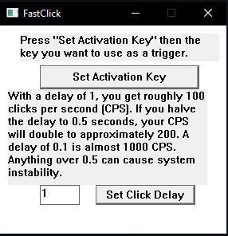

# Ultra-Clicker
An ultrafast windows based clicker

This is as stripped down of a fast clicker as I can make with my skillset. Anyone willing to see if they can do better and maintain system stability please feel free to jump at it. 
Version 1.0 is pretty raw  but does the job, programed in C++ using Visual studio.
  
Instructions are displayed in the program however.
  
To set the activation key  
* Press the **"Set Activation Key"** button.
* Then, press and release the desired activation key.
* A message box will appear confirming that the key has been changed successfully.
* Press **OK**

  
  
The default click delay of 1 second results in approximately 100 clicks per second (or 100 CPS) on my setup. When the delay between mouse clicks is doubled, it takes twice as long to perform each click, so the number of clicks performed in a second will be halved—resulting in 50 clicks per second or 50 CPS. Conversely, when the delay is halved (to 0.5 seconds), the time between each click is reduced by half, allowing for more clicks to be performed within a second—doubling the CPS to approximately 200 clicks per second.
So CPS is Aprox related to the following

| Delay    |   CPS    |
|----------|----------|
|     4    |     25   |
|     3    |     33   |
|     2    |     50   |
|     1    |    100   |
|    0.5   |    200   |
|    0.25  |    400   |
|    0.1   |   1000   |

  Please note that delay values less than 0.5 while they do work tend to cause some system instability and can cause issues with the sheer number of clicks preformed.  
  In my testing this can cause programs to:
  - Lockup
  - Slowdown
  - crash
